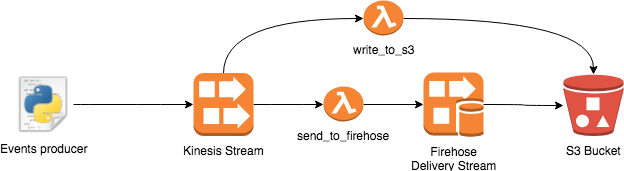

# aws-streaming-pipeline

## Requirements
* python3.6
* pip
* Docker

### Development
Install the libs running:
<pre>
pip install -r requirements.txt
for i in consumers/*/; do pip install -r $i"requirements.txt"; done
</pre>

## Infrastructure
The infrastructure is provisioned using Cloudformation. It is split in 2 mains stacks:
* data-sources stack that consists of:
	* S3 Bucket used for to store the artifacts produced to deploy the Lambda functions
	* S3 Bucket used to store the Output of the Lambda functions

* stream stack that consists of:
	* Kinesis stream with 2 shards
	* Lambda function *write_to_s3*, setup as consumer for the stream, to write the events to S3
	* Execution role for the Lambda function *write_to_s3*
	* Lambda function *send_to_firehose*, setup as consumer for the stream, to send the event to Firehose Delivery Stream
	* Execution role for the Lambda function *send_to_firehose*
	* Firehose Delivery Stream, configured to deliver to S3
	* Firehose Delivery Stream Execution Role, necessary to put object to S3

### Architecture

### Init the infrastructure
* First create the `data-sources` stack
	<pre>
	bash scripts/create_data_source_stack.sh
	</pre>

* Create a zipped file to init the lambda functions, and upload to S3
	<pre>
	cd consumers/init_consumer
	zip -r init.zip .
	aws s3 cp init.zip s3://streaming-pipeline-dev-deployment/consumers/
	cd ..
	</pre>
	
* Create the `stream` stack
	<pre>
	bash scripts/create_stream_stack.sh
	</pre>
	**NOTE**: if the S3 key consumers/init.zip is not uploaded in the S3 Bucket used for deployment, the stack creation will fail

All the stack and resources contains a stage parameters, to simplify the creation of the stacks for multiple stages.

### Producer
In order to test the proposed solution, we needed to implement a producer, that put the records to the stream.
The producer use a sample csv from a [Kaggle competition](https://www.kaggle.com/c/pkdd-15-predict-taxi-service-trajectory-i/data)
It's possible to the send sample records, just calling:
<pre>
python producer/producer.py
</pre>

## Unit tests
<pre>
pytest -vv tests/*
</pre>

## CI/CD
At each push to a remote branch Travis is triggered. It will take care of:
* running the unit tests
* preparing the zipped lambda function(containing all needed requirements)
* update the stream stack with the latest build code for the lambdas

**NOTE**: it's possible to have a production stack, that is deployed only when merging a PR in the master branch

## Considerations
The records in Kinesis are consumed by 2 lambda functions.
The `write_to_s3` lambda receive the records and write them as JSON to S3, creating a unique path each time that a nex batch is received.
The file written by such consumer can be really small, the size can be even smaller when adding more shards.
This is due to the fact that the lambda is invoked many times with a limited amount of events.
The produced files are hard to read with applications like Spark/Presto/Athena, because they will create a not needed network overhead.
To solve this problem we can easily create a consumer that send the record to Firehose, then firehose will take care of
writing the file to S3 only when specific conditions are reached, for example in this implementations
the files saved written to S3 with a max size of 5MB. We also implemented a JSONlines structure 
to make the file easier to read for Spark/Presto/Athena.
To test that, it's possible to create an Athena table, DDL are in `athena/taxi_trajectories.sql`.

### Improvements
* It's possible to add a Lambda function that autoscale the number of Kinesis shards to support spikes of Incoming Bytes.
	This can be achive setting up a Cloudwatch alarm that trigger the lambda when a specific limit is reached. 
	The lambda then calculates the shards number based on the latest incoming bytes
* Add Alarms to monitor when the invocations of the lambda functions fails
* Adding a JSON schema validation process in the lambdas will guarantee to have more quality in the received records.
	This is event more valid when implementing a consumer that write to a DB, that generally is much less flexible then S3
